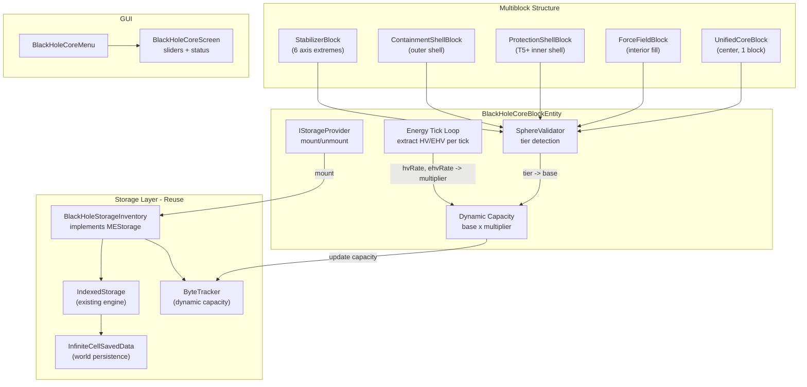
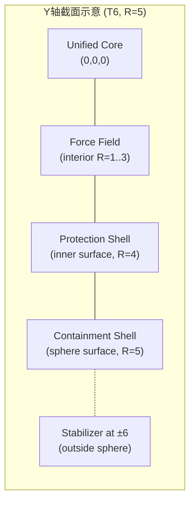

# 黑洞存储阵列 — 球形多方块设计方案

## 架构总览




## 1. 多方块结构 — 分层体素球

### 1.1 五种方块（从内到外）


| #   | 方块         | 注册 ID                   | 用途                                |
| --- | ---------- | ----------------------- | --------------------------------- |
| 1   | **统一核心**   | `unified_core`          | 球心，多方块控制器，含 BlockEntity           |
| 2   | **力场填充**   | `force_field_block`     | 填充核心与壳层之间的内部体积                    |
| 3   | **保护层**    | `protection_shell`      | T5-T8 新增的次外壳层                     |
| 4   | **约束外壳**   | `containment_shell`     | 球体最外层表面                           |
| 5   | **多方块稳定器** | `multiblock_stabilizer` | 球体外侧 6 个轴极点，悬浮于球外；T8 时被球体包裹成为表面方块 |


### 1.2 分层规则

体素球 `x^2 + y^2 + z^2 <= R^2` 为球体，稳定器在球体**外侧**轴极点 `(±(R+1), 0, 0)` 等 6 处。
球+稳定器总包围盒 = `(2R+3)^3`，约束 `<= 15^3` → **R_max = 6**（T8 特殊处理）。




**位置 → 方块映射算法**（给定 tier 对应的球体半径 R）：

**T2-T7 (R=1..6) — 稳定器在球外:**

1. `(0,0,0)` → **Unified Core**
2. 6 个轴极点 `(±(R+1), 0, 0)`, `(0,±(R+1), 0)`, `(0,0,±(R+1))` → **Stabilizer** (球外悬浮)
3. 球体最外层表面（`x^2+y^2+z^2 > (R-1)^2` 且 `<= R^2`） → **Containment Shell**
4. **T5+ (R>=4) 专属**：次外层表面（`> (R-2)^2` 且 `<= (R-1)^2`） → **Protection Shell**
5. 球体内部其余位置 → **Force Field**

**T1 (R=0) — 仅核心:** 无壳层方块

**T8 (R=7) — 稳定器被球体包裹:**
球体生长至 R=7 (15^3)，原先悬浮在 ±7 的稳定器被球表面"吞没"，成为球面上的嵌入点。
此时稳定器位于球体表面 `(±7,0,0)` 等位置（不再在球外），其余规则同上。
从 T7→T8 升级时，玩家填充 R=6 到 R=7 之间的空隙，旧的 Containment Shell(R=6) 变为 Protection Shell，新的 R=7 表面成为 Containment Shell。

### 1.3 层级定义（T1-T8）

球+稳定器总包围盒最大 **15x15x15**。稳定器在球体外侧 `(±(R+1), 0, 0)` 处悬浮。
T1-T4 使用 2 种结构方块，T5-T8 新增 Protection Shell。


| Tier | R   | 球体包围盒    | 含 Stab 总包围盒 | 近似方块数     | 结构方块                   | base   |
| ---- | --- | -------- | ----------- | --------- | ---------------------- | ------ |
| T1   | 0   | 1^3      | 1^3         | 1         | -                      | 1 MB   |
| T2   | 1   | 3^3      | 5^3         | 7+6=13    | FF+Shell+Stab          | 4 MB   |
| T3   | 2   | 5^3      | 7^3         | 33+6=39   | FF+Shell+Stab          | 16 MB  |
| T4   | 3   | 7^3      | 9^3         | 123+6=129 | FF+Shell+Stab          | 64 MB  |
| T5   | 4   | 9^3      | 11^3        | 257+6=263 | FF+**Prot**+Shell+Stab | 256 MB |
| T6   | 5   | 11^3     | 13^3        | ~521      | FF+Prot+Shell+Stab     | 1 TB   |
| T7   | 6   | 13^3     | **15^3**    | ~911      | FF+Prot+Shell+Stab     | 16 TB  |
| T8   | 7   | **15^3** | **15^3**    | ~1419     | FF+Prot+Shell(+Stab嵌入) | 256 TB |


- **T1** (R=0): 仅核心方块，无壳层，提供 1 MB 基础存储
- **T2-T7**: 稳定器悬浮在球外 `(±(R+1), 0, 0)` 等 6 处
- **T7** (R=6): 包围盒 `(2*6+3)^3 = 15^3`，达到尺寸上限
- **T8** (R=7): 球体扩展至 R=7 (15^3)，将 T7 的外部稳定器(±7)"吞入"球面，不再悬浮。玩家填充 R=6..R=7 空隙，旧 Shell(R=6面) 换为 Protection Shell，新 R=7 面成为 Shell。自动建造系统引导替换
- **T5+** (R>=4): 球体深度足够容纳 Protection Shell（次外表面）

base 增长 4x/级，从 1 MB 到 256 TB 跨越 8 个数量级。各值可通过 `AE2LTCommonConfig` 配置。模板由 `SphereTemplate` 静态预计算。

### 1.4 验证机制

- **触发**: 核心/壳层方块的 `onPlace` / `neighborChanged` → 通知核心 BE 重新扫描
- **扫描**: 从 T8 向 T0 逐级检查，第一个完整匹配的层级即为当前 tier
- **热升级**: 运行中扩建壳层，tier 自动提升，不丢数据，容量实时增长
- **热降级**: 拆除壳层时 tier 降低，若 `usedBytes > newCapacity` 则自动进入只读

## 2. 容量公式

```
effectiveCapacity = base(tier) * multiplier(hvRate, ehvRate)
multiplier = (1 + hvRate / K_hv) * (1 + ehvRate / K_ehv)^2
```

- `hvRate` / `ehvRate`: 玩家在 GUI 中设定的每 tick 消耗目标量
- `K_hv = 100`, `K_ehv = 10` (可在 `AE2LTCommonConfig` 中配置)
- EHV 项平方增长，激励玩家投资 EHV 基础设施
- 乘数无上界 → 理论容量趋于无限


| HV/tick | EHV/tick | multiplier | T3 有效容量 |
| ------- | -------- | ---------- | ------- |
| 0       | 0        | 1x         | 256 GB  |
| 100     | 0        | 2x         | 512 GB  |
| 100     | 10       | 4x         | 1 TB    |
| 1000    | 100      | 121x       | ~30 TB  |


## 3. 能量消耗与只读机制

`BlackHoleCoreBlockEntity.serverTick()` 每 tick 执行:

```java
long gotHV = grid.getStorageService().getInventory()
    .extract(LightningKey.of(HIGH_VOLTAGE), requestedHV, MODULATE, src);
long gotEHV = grid.getStorageService().getInventory()
    .extract(LightningKey.of(EXTREME_HIGH_VOLTAGE), requestedEHV, MODULATE, src);

double mult = (1.0 + gotHV / K_HV) * Math.pow(1.0 + gotEHV / K_EHV, 2);
long effCapLo = (long)(baseLo * mult);  // clamped to avoid overflow
boolean readOnly = ByteTracker.exceeds(usedBytesHi, usedBytesLo, effCapHi, effCapLo);
```

- `readOnly = true` 时: `insert()` 返回 0, `extract()` 正常工作
- GUI 中显示: 当前层级、base 容量、实际消耗 HV/EHV、乘数、有效容量、已用容量、读写状态
- 能量不足 → 乘数降低 → 有效容量缩小 → 可能触发只读, 但**绝不丢数据**

## 4. ME 网络接入

`BlackHoleCoreBlockEntity` 实现 `IStorageProvider`:

```java
public class BlackHoleCoreBlockEntity extends AEBaseBlockEntity
        implements IStorageProvider, IGridTickable {

    @Override
    public void mountInventories(IStorageMounts mounts) {
        if (cluster != null && cluster.isFormed()) {
            mounts.mount(blackHoleStorage, priority);
        }
    }
}
```

- 多方块形成时调用 `IStorageProvider.requestUpdate(mainNode)` 将存储挂载到网格
- 多方块拆解时再次 `requestUpdate` 移除存储
- 存储优先级可在 GUI 中调节

## 5. BlackHoleStorageInventory

新建 `BlackHoleStorageInventory implements MEStorage`, 包装 `IndexedStorage` + `ByteTracker`:

- 类似 `InfiniteCellInventory`, 但:
  - 不绑定 `ItemStack`, 而是绑定 `BlackHoleCoreBlockEntity`
  - `insert()` 检查 `readOnly` 标志, 为 true 时返回 0
  - 容量通过 `ByteTracker.configure()` 动态更新 (每 tick 由 BE 调用)
  - `persist()` 由 `SavedData.save()` 统一触发

## 6. 数据持久化

复用现有 `InfiniteCellSavedData` + `IndexedStorage` 引擎:

- 核心方块首次形成时生成 UUID, 存入 BlockEntity NBT
- 通过 UUID 在 SavedData 中注册/查找 `IndexedStorage`
- 多方块拆解时数据保留 (核心方块记住 UUID)
- 重新组装后通过 UUID 恢复全部数据

## 7. 自动建造系统

类似龙研的引导建造:

- **结构预览**: 核心放置后, `BlackHoleCoreRenderer`(BER) 在目标层级的所有位置渲染幽灵方块
  - 正确位置已有正确方块 → 不渲染
  - 缺失位置 → 渲染对应类型的幽灵方块 (半透明蓝色), 按分层规则选择正确的方块类型
  - 错误方块类型 → 渲染正确类型 (半透明红色边框)
- **目标层级选择**: GUI 中选择要预览/建造到哪个 tier (默认当前 tier+1)
- **自动放置**: GUI 中提供"自动建造"按钮
  - 从玩家背包中按需消耗 ForceField / ProtectionShell / ContainmentShell / Stabilizer
  - 逐层向外放置, 带动画延迟 (每 tick 放几个), 内层先于外层
  - C2S 数据包触发, 服务端验证方块来源并执行 `level.setBlock()`

## 8. 新增文件清单

**方块 (5 种 + BE):**

- `block/UnifiedCoreBlock.java` — 核心方块, `onPlace`/`neighborChanged` 触发验证, 含 BE
- `block/ForceFieldBlock.java` — 力场填充, 简单方块, `neighborChanged` 搜索附近核心并通知
- `block/ProtectionShellBlock.java` — 保护层, 同上
- `block/ContainmentShellBlock.java` — 约束外壳, 同上
- `block/MultiblockStabilizerBlock.java` — 稳定器, 同上
- `blockentity/BlackHoleCoreBlockEntity.java` — 核心 BE, `IStorageProvider` + `IGridTickable` + 能量 + 验证

**多方块:**

- `multiblock/SphereTemplate.java` — 静态预计算 T0-T8 各层级体素球坐标 + 每个位置对应的方块类型
- `multiblock/SphereValidator.java` — 结构验证: 遍历模板检查世界方块, 返回最高完整层级

**存储:**

- `me/cell/BlackHoleStorageInventory.java` — MEStorage 实现, 包装 IndexedStorage + 动态 ByteTracker + readOnly 标志

**GUI:**

- `menu/BlackHoleCoreMenu.java` — 服务端菜单, 同步状态 + 处理滑块/按钮数据包
- `client/gui/BlackHoleCoreScreen.java` — 客户端 GUI: 层级/容量/读写状态面板, HV/EHV 滑块, 目标层级选择, 自动建造按钮

**渲染:**

- `client/render/BlackHoleCoreRenderer.java` — BER: 幽灵方块预览 (按类型着色) + 黑洞粒子效果

**网络:**

- `network/EnergyConfigPacket.java` — C2S, 同步 GUI 滑块设置
- `network/AutoBuildPacket.java` — C2S, 触发自动建造 (含目标 tier)

## 9. 修改文件清单

- `registry/ModBlocks.java` — 注册 5 种新方块: `unified_core`, `force_field_block`, `protection_shell`, `containment_shell`, `multiblock_stabilizer`
- `registry/ModBlockEntities.java` — 注册 `BlackHoleCoreBlockEntity`
- `registry/ModItems.java` — 注册 5 种对应 BlockItem
- `me/cell/ByteTracker.java` — 新增 `updateCapacity(lo, hi)` 方法支持运行时动态容量变更
- `me/cell/InfiniteCellSavedData.java` — 确保 BlockEntity 也能注册/获取 `IndexedStorage` (不仅是 ItemStack)
- `AE2LTCommonConfig.java` — 新增 K_hv, K_ehv, 各层级 R 值与 base 容量配置
- `AE2LightningTech.java` — 注册菜单类型、数据包、创意栏物品
- 资源文件: blockstates, models, textures, lang, loot_table, recipe JSON (5 种方块各一套)

