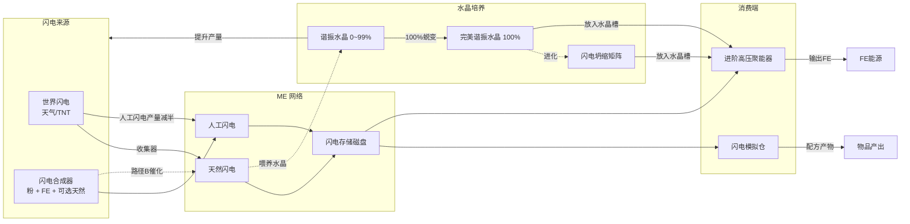
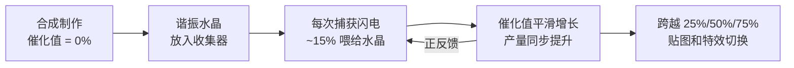
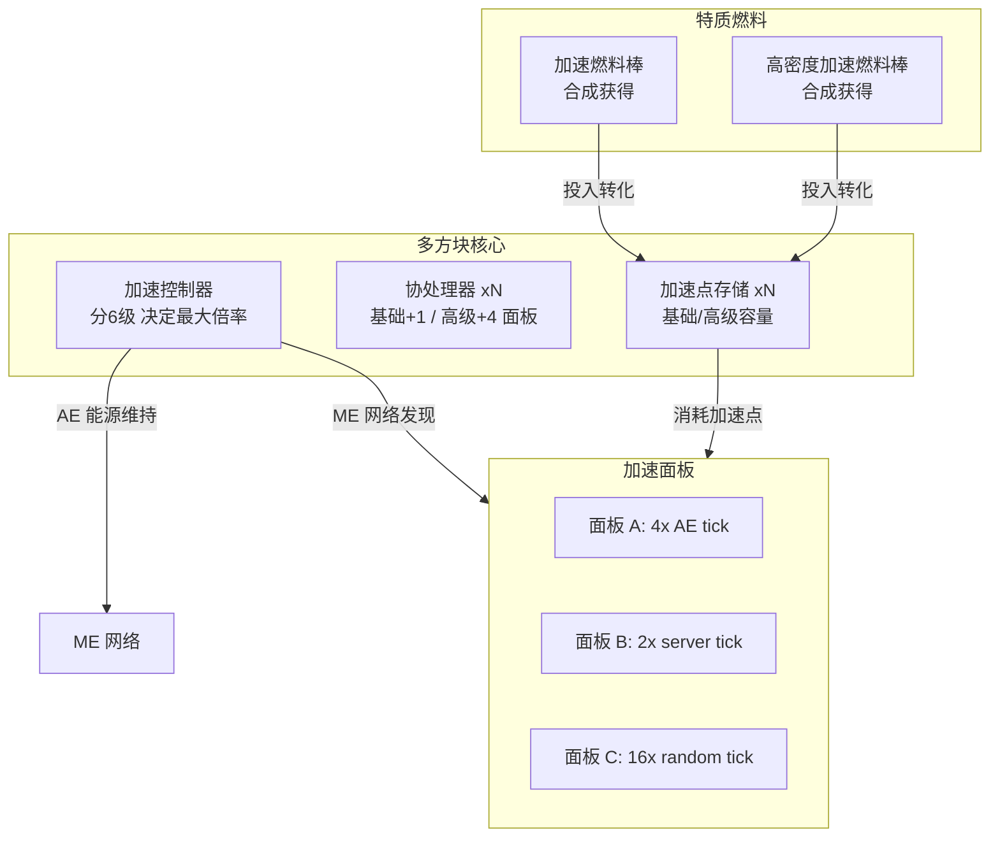

# 闪电收集与存储系统设计方案

## 一、系统总览



**进度链**：过载水晶 → 闪电收集器 + 闪电存储磁盘 → 收集天然闪电 → 合成谐振水晶放入收集器培养 → 闪电合成器量产人工闪电 → 闪电模拟仓 → **雷暴诱发器（中期天气控制）** → 进阶高压聚能器 → 完美水晶 → 闪电坍缩矩阵

---

## 二、AE2 自定义 AEKeyType：闪电

### 2.1 类型注册

新增 `LightningKeyType extends AEKeyType`：

- 注册 ID：`ae2lt:lightning`
- 在 `RegisterEvent` 中调用 `AEKeyTypes.register(...)` 注册到 AE2 的 `ae2:keytypes` registry

关键参数：

- `getAmountPerByte()` = 64（一个 byte 存 64 单位闪电；1k cell ≈ 65,536 单位，贴合闪电经济规模）
- `getAmountPerOperation()` = 1（每次操作最小单位 1 闪电）
- `getAmountPerUnit()` = 1

### 2.2 AEKey 子类

新增 `LightningKey extends AEKey`（单个类，通过字段区分品质）：

```java
public class LightningKey extends AEKey {
    public enum Quality { NATURAL, ARTIFICIAL }
    
    private final Quality quality;
    
    // 全局单例
    public static final LightningKey NATURAL = new LightningKey(Quality.NATURAL);
    public static final LightningKey ARTIFICIAL = new LightningKey(Quality.ARTIFICIAL);
}
```

- `getType()` → `LightningKeyType` 实例
- `getPrimaryKey()` → `Quality` 枚举值（用于区分两种闪电）
- `equals/hashCode` 基于 `Quality`
- `computeDisplayName()` → "天然闪电" / "人工闪电"
- `getId()` → `ae2lt:natural_lightning` / `ae2lt:artificial_lightning`
- `addDrops()` → 空实现（闪电不能掉落为实体）
- `writeToPacket` / `readFromPacket` → 写/读 1 byte quality ordinal

### 2.3 涉及文件

- 新建 `src/main/java/com/moakiee/ae2lt/me/key/LightningKeyType.java`
- 新建 `src/main/java/com/moakiee/ae2lt/me/key/LightningKey.java`
- 修改注册入口（`AE2LightningTech` 或新建 `ModAEKeyTypes`），在 `RegisterEvent` 中注册

---

## 三、闪电存储磁盘

### 3.1 存储组件 + 外壳

参照 AE2 的 item/fluid cell 模式：

- **闪电存储组件**（`LightningStorageComponent`）：普通物品，定义存储容量
  - 1k 闪电组件 / 4k / 16k / 64k（与物品磁盘体系对齐）
- **闪电存储磁盘**（`LightningStorageCell`）：`IBasicCellItem` 实现
  - `getKeyType()` → `LightningKeyType` 实例
  - `getBytes()` → 根据组件等级返回 1024 / 4096 / 16384 / 65536
  - `getTotalTypes()` → 2（天然 + 人工最多两种 key）
  - `getIdleDrain()` → **256 × kb 数 AE/t**（1k=256, 4k=1024, 16k=4096, 64k=16384）
    - 极高功耗设计：闪电是高能不稳定资源，存储需要持续大量 AE 维持
    - 单个 64k 磁盘消耗 16,384 AE/t，约占单控制器（25,600 AE/t）64% 产能
    - 这迫使玩家在闪电存储规模和 ME 网络能量预算之间做取舍

由于 AE2 的 `BasicCellHandler` 自动识别 `IBasicCellItem`，无需额外注册 `ICellHandler`。

### 3.2 合成配方

- 闪电存储组件：过载水晶 + 红石 + AE2 逻辑处理器（压印器配方）
- 闪电存储磁盘：闪电存储组件 + AE2 空磁盘外壳（有序合成）

### 3.3 Drive 模型

- `StorageCellModels.registerModel(...)` 注册闪电磁盘在 ME 驱动器中的渲染模型（客户端）

### 3.4 涉及文件

- 新建 `src/main/java/com/moakiee/ae2lt/item/LightningStorageCellItem.java`
- 新建 `src/main/java/com/moakiee/ae2lt/item/LightningStorageComponentItem.java`（或直接用普通 Item）
- `ModItems.java` 注册新物品
- 资源文件：模型/纹理/配方 JSON

---

## 四、闪电收集器（Lightning Collector）

### 4.1 功能

- **方块实体**，连接 ME 网络（`AENetworkedBlockEntity` 或类似基类）
- 监听世界中发生在自身位置附近的闪电事件
- 每次捕获闪电 → 向 ME 网络插入 `LightningKey.NATURAL` 若干单位
- 需要在方块上方放置避雷针（`minecraft:lightning_rod`）以增加捕获概率/范围

### 4.2 谐振水晶催化系统（独立体系，连续百分比）

收集器内部有一个**谐振水晶槽**，放入「谐振水晶」提升产量。谐振水晶是**独立于四级萌芽体系的单一物品**，内部维护一个连续的**催化值**（0 ~ MAX），催化百分比直接决定产量。

#### 核心机制：催化值 = 百分比产量

**单一物品 `ResonanceCrystalItem`**，DataComponent 存储：

- `catalysisValue`（long）：当前已吸收的闪电量，范围 0 ~ `MAX_CATALYSIS`（256）
- 催化百分比 p = `catalysisValue / MAX_CATALYSIS`，0% 到 100% 平滑过渡

**产量公式**：

- 无水晶：天然 1-4 / 人工 1-2
- 谐振水晶（0% ~ 99%），催化百分比 p：
  - 天然闪电产量 = `lerp(4, 32, p)` +/- 随机浮动
  - 人工闪电产量 = 天然产量 / 2
- **完美谐振水晶**（100% 蜕变后的独立物品）：
  - 天然闪电产量 = **固定 32**（无随机浮动）
  - 人工闪电产量 = **固定 16**（无随机浮动）

示例：催化值 50% 时天然产量约 18 +/- 浮动；完美谐振水晶固定 32，稳定可靠。

#### 视觉阶段（4 阶段贴图 + 特效）

催化值连续，但**视觉表现分 4 个阶段**（不同贴图 + 粒子特效），通过 `ItemProperties` 注册 `catalysis_stage` property（值 0-3）驱动模型选择。阶段阈值为指数递进 **4 / 16 / 64 / 256**：

- **阶段 1（0 ~ 3）**：暗淡水晶，微弱电弧纹理，偶尔闪烁粒子
- **阶段 2（4 ~ 15）**：蓝紫色稳定脉冲纹理，持续小粒子
- **阶段 3（16 ~ 63）**：明亮辉光纹理，较强的电弧粒子效果
- **阶段 4（64 ~ 255）**：完美共振纹理，全身发光 + 密集闪电粒子
- **完成（256）**：催化值满后，收集器自动将水晶**蜕变为全新物品「完美谐振水晶」**（`PerfectResonanceCrystalItem`），产量固定为 32，不再有随机浮动，且可从收集器中取出作为独立成品使用

物品 tooltip 同时显示精确百分比数值和当前阶段名称。完美谐振水晶的 tooltip 标注「已完成培养」。

#### 喂养与培养



1. **谐振水晶**通过合成配方制作（催化值 = 0%）：过载水晶 + 铁锭 + 红石（具体待定）
2. 放入收集器后，**仅天然闪电会喂养水晶**（~15% 的天然闪电产量用于催化），人工闪电不参与催化
3. 喂养量 = `max(1, floor(产量 * 0.15))`，**保底每次至少 1 单位**，避免 0% 冷启动卡死
4. `catalysisValue` 平滑增长，产量同步平滑提升——没有突变的「升级」瞬间，只有视觉阶段跨越时的贴图切换
5. 催化值达到 MAX 时，收集器 tick **自动将水晶替换为完美谐振水晶**（`PerfectResonanceCrystalItem`），无需手动取出
6. 取出水晶后催化值保留在 DataComponent 中，可换机器继续培养

**天然闪电的双重价值**：天然闪电不仅产量更高、品质更好，还是唯一能培养谐振水晶的来源——进一步强化「天然闪电 = 稀缺高价值资源」的定位。人工闪电（TNT 等）只产出 `LightningKey.ARTIFICIAL` 进 ME，不推动水晶成长。

**粗略培养节奏估算**（天然闪电，15% 喂养保底 1，MAX = 256）：

- 阶段 1（0 -> 4）：产量 ~4，喂养 1/次，约需 **4 次**闪电（很快看到初始进展）
- 阶段 2（4 -> 16）：产量 ~5，喂养 1/次，约需 **12 次**闪电
- 阶段 3（16 -> 64）：产量 ~8，喂养 1/次，约需 **48 次**闪电
- 阶段 4（64 -> 256）：产量 ~18，喂养 ~2.7/次，约需 **71 次**闪电
- **总计约 ~135 次闪电从 0 培养到 256（完美）**

指数阈值的好处：前期进展快、反馈即时，后期投入指数增长、有成就感。

**设计要点**：

- 产量为范围值（基于催化百分比的期望值 +/- 随机浮动）
- 人工闪电**产量减半**，产出 `LightningKey.ARTIFICIAL`
- 闪电类型判断复用已有的 `isNaturalWeatherLightning` 标记
- `MAX_CATALYSIS`（默认 256）、阶段阈值（4/16/64/256）和喂养比例可通过配置文件调整
- 收集器水晶槽**仅接受谐振水晶**（不接受完美谐振水晶和闪电坍缩矩阵——收集器的目的是收集和培养，完美水晶和矩阵应放入聚能器）
- GUI 显示：催化百分比进度条、当前阶段名称、预估产量范围

### 4.3 捕获机制

复用已有的闪电事件基础设施（`LightningItemTransformationHandler` 使用的 `EntityJoinLevelEvent`）：

- 新增 handler 或在现有 handler 中增加逻辑：当闪电实体生成时，扫描一定范围内的 Lightning Collector
- 天然闪电 → 产出**天然闪电** (`LightningKey.NATURAL`)
- 人工闪电 → 产出**人工闪电** (`LightningKey.ARTIFICIAL`)，产量为同品质天然的一半
- 收集器有冷却时间（如 100 tick），防止 TNT 连续刷闪电
- 需要方块上方有避雷针（`minecraft:lightning_rod`）以增加捕获范围

### 4.4 涉及文件

- 新建 `src/main/java/com/moakiee/ae2lt/blockentity/LightningCollectorBlockEntity.java`
- 新建对应的 Block、Menu、Screen 类（需要 GUI 来放置/查看水晶槽）
- `ModBlocks.java` / `ModBlockEntities.java` 注册
- 修改闪电事件 handler 或新增独立 handler

---

## 五、闪电合成器（Lightning Synthesizer）

### 5.1 功能

- **方块实体**，连接 ME 网络
- 物品输入槽：过载水晶粉
- FE 输入：从外部或通过 AppFlux 从 ME 获取
- 输出：`LightningKey.ARTIFICIAL` 直接插入 ME 网络

### 5.2 合成逻辑

两条并存的合成路径：

**路径 A：纯粉合成（基础）**

- 消耗：N 过载水晶粉 + FE
- 产出：少量人工闪电
- 示例：4x 过载水晶粉 + 50,000 FE → 1 单位人工闪电

**路径 B：天然闪电催化（高效）**

- 消耗：1 天然闪电（从 ME 网络提取）+ N 过载水晶粉 + FE
- 产出：大量人工闪电（M > 1，天然闪电的能量被「放大」）
- 示例：1 天然闪电 + 4x 过载水晶粉 + 50,000 FE → 8 单位人工闪电

设计意图：天然闪电稀缺但可以催化出远超自身的人工闪电产量，形成「天然闪电 = 高价值催化剂」的经济模型。玩家前期用路径 A 缓慢积累，中后期通过收集天然闪电走路径 B 大幅提升效率。

**处理方式**：

- `IGridTickable` 驱动，不用 block entity ticker
- **闪电配置槽**（类似 AE2 接口的 ConfigInventory 虚拟槽）：玩家可将天然闪电或人工闪电 key 拖入槽位，指定合成器从 ME 提取哪种闪电用于路径 B 催化。空槽 = 仅路径 A（不消耗天然闪电）
- 物品输入槽放过载水晶粉，闪电按配置槽设定从 ME 网络 `extract`
- 每 tick 消耗 FE 直到满足总量 → 消耗水晶粉 + 配置槽指定的闪电（如有）→ 插入人工闪电到 ME
- 支持速度卡升级
- FE 消耗采用进度条模式：中断后保留已充入的 FE 进度，恢复供电后继续；水晶粉和闪电仅在 FE 充满后一次性消耗（避免中断丢材料）

### 5.3 涉及文件

- 新建 `src/main/java/com/moakiee/ae2lt/blockentity/LightningSynthesizerBlockEntity.java`
- 新建对应的 Block、Menu、Screen 类
- `ModBlocks.java` / `ModBlockEntities.java` / `ModMenuTypes.java` 注册

---

## 六、气象控制器 + 天气凝核（Weather Controller）

### 6.1 天气凝核（消耗品物品，三种）

每种凝核对应一种天气，放入气象控制器消耗后切换天气：

| 凝核物品 | 目标天气 | 合成材料 | 定位 |
|---------|---------|---------|------|
| 晴空凝核 | 晴天 | 过载水晶粉 x4 + 萤石粉 x4 + FE | 基础，清除恼人的雨天 |
| 降雨凝核 | 雨天 | 过载水晶粉 x8 + 水桶 + FE | 辅助，配合其他 mod 机制 |
| 雷暴凝核 | 雷暴 | 128 天然闪电 + 过载水晶 + 下界之星 | 核心，奇点级成本 |

- 晴空/降雨凝核成本较低，提供通用天气控制便利
- 雷暴凝核成本极高（128 天然闪电），是中期加速天然闪电获取的关键手段

### 6.2 气象控制器（方块实体）

- 连接 ME 网络，有一个**凝核物品槽**（接受三种凝核）
- 放入任意凝核后，消耗 FE 启动（雷暴凝核 5,000,000 FE / 降雨 1,000,000 FE / 晴空 500,000 FE）
- FE 充满后**消耗凝核**，将当前天气强制切换为对应类型
- 天气持续时间为正常范围（雷暴 3,600 ~ 15,600 ticks / 雨天 12,000 ~ 24,000 ticks / 晴天 12,000 ~ 180,000 ticks）
- **无冷却时间**：平衡完全由凝核的合成成本控制。玩家有足够资源即可连续切换
- 若当前已是目标天气，不消耗凝核，提示"当前已是该天气"

### 6.3 经济分析（雷暴凝核）

以完美水晶收集器为例（每次雷击固定 32 天然闪电，每次雷暴约 19 次雷击）：

- 每次雷暴收集约 **608 天然闪电**
- 制作 1 个雷暴凝核需要 **128 天然闪电** ≈ 一次雷暴收益的 **21%**
- 净收益：608 - 128 = **480 天然闪电**（约 79% 利润率）
- 无完美水晶时利润率更低，催化值低时甚至可能亏本——鼓励先培养水晶
- 无冷却意味着玩家可以连续触发雷暴，但每次都要消耗 128 天然闪电，资源是唯一限制

### 6.4 涉及文件

- 新建 `src/main/java/com/moakiee/ae2lt/item/WeatherCondensateItem.java`（单个类，通过 DataComponent 或子类区分三种天气）
- 新建 `src/main/java/com/moakiee/ae2lt/blockentity/WeatherControllerBlockEntity.java`
- 新建对应的 Block、Menu、Screen 类
- `ModItems.java` / `ModBlocks.java` / `ModBlockEntities.java` 注册
- 配方 JSON（三种凝核合成）

---

## 七、闪电模拟仓改造

### 7.1 催化剂从物品槽改为 ME 网络闪电

**当前流程**：检查 slot 3 的 16x 过载水晶粉或 1x 闪电坍缩矩阵 → 消耗水晶粉

**改造后**：

- 保留 slot 3 物理槽位，改为**可选**的闪电坍缩矩阵槽
- 无矩阵时：从 ME 网络 `extract(LightningKey, amount, ...)` 消耗闪电，按优先级模式选择天然/人工
- 有矩阵时：**矩阵允许用人工闪电替代天然闪电**执行 `requireNatural = true` 的配方，但代价是**闪电消耗量翻倍**（`lightningCost * 2`），且矩阵本身不消耗（持久催化剂）
  - 即：矩阵不是「免费旁路」，而是「品质转换器」——用 2 倍人工闪电等效 1 倍天然闪电
  - 无矩阵时 `requireNatural` 配方只能消耗天然闪电，有矩阵时也可用人工闪电但加倍
- 每次配方消耗量：配方 JSON 新增可选字段 `"lightningCost": 8`（默认值 8）

### 7.2 品质偏好（可配置优先级）

- 配方 JSON 新增可选字段 `"requireNatural": false`（默认 false）
- `requireNatural = true` 的配方只接受天然闪电

**消耗优先级由玩家在 GUI 中配置**，模拟仓新增一个切换按钮（类似 AE2 的 redstone mode 按钮），三种模式：

- **优先人工**（默认）：先 `extract(ARTIFICIAL, cost, SIMULATE)` → 不足再补 `NATURAL`
- **优先天然**：先 `extract(NATURAL, cost, SIMULATE)` → 不足再补 `ARTIFICIAL`
- **仅天然**：只消耗 `NATURAL`，网络中无天然闪电时暂停配方

模式存储在方块实体 NBT 中，通过 `@GuiSync` 同步到客户端 Menu。`requireNatural = true` 的配方强制走「仅天然」路径，忽略玩家设置。

### 7.3 需要修改的文件

核心改动点：

- `LightningSimulationRecipeService.hasRequiredOverloadDust`（`src/main/java/com/moakiee/ae2lt/machine/lightningchamber/recipe/LightningSimulationRecipeService.java`）
  - 重命名为 `hasSufficientCatalyst`
  - 增加 ME 网络闪电检查分支（slot 3 无矩阵时，simulate 从网络取闪电）
- `LightningSimulationChamberBlockEntity.completeLockedRecipe`（`src/main/java/com/moakiee/ae2lt/blockentity/LightningSimulationChamberBlockEntity.java`）
  - 水晶粉消耗路径替换为 `me.extract(LightningKey, cost, Actionable.MODULATE, src)`
  - 优先消耗 ARTIFICIAL，不足补 NATURAL
- `LightningSimulationRecipe`（`src/main/java/com/moakiee/ae2lt/machine/lightningchamber/recipe/LightningSimulationRecipe.java`）
  - Codec 增加 `lightningCost` (int, optional, default 8) 和 `requireNatural` (boolean, optional, default false)
- `LightningSimulationLockedRecipe`（`src/main/java/com/moakiee/ae2lt/machine/lightningchamber/recipe/LightningSimulationLockedRecipe.java`）
  - 持久化字段从 `overloadDustCost` 改为 `lightningCost` + `requireNatural`
- `LightningSimulationChamberInventory` / Menu / Screen（`src/main/java/com/moakiee/ae2lt/machine/lightningchamber/LightningSimulationChamberInventory.java`）
  - Slot 3 仅接受闪电坍缩矩阵（不再接受水晶粉）
  - GUI 显示当前 ME 中的闪电存量和配方所需量

---

## 八、高压聚能器体系（普通 + 进阶）

### 8.1 普通高压聚能器（现有，微调）

保持现有 `HighVoltageAggregatorBlockEntity` 的世界闪电激活机制，但发电量对齐到**无水晶收集器**的产量：

- 被世界闪电击中时，等效收集 **1-4 单位闪电**（无水晶基础产量），人工闪电减半（1-2）
- 每单位闪电转化为一定的**高压 ticks**（如 1 单位 = N ticks 高压模式）
- 不连接 ME 网络，不消耗存储闪电，无水晶槽
- 定位：前期过渡发电设备

### 8.2 进阶高压聚能器（新增）

连接 ME 网络，有单个**水晶槽**（接受谐振水晶 / 完美谐振水晶 / 闪电坍缩矩阵），支持两种发电来源。

#### ME 闪电发电（主动模式）

从 ME 网络消耗存储的闪电，持续转化为 FE：

- 基础发电量（无水晶）：1 单位闪电 = 基础 FE（如 500,000 FE）
- **有水晶时发电量随催化百分比提升**（类似收集器产量公式）

**水晶与闪电类型的交互——核心取舍**：

人工闪电发电效率始终低于天然闪电，但随水晶品质提升逐渐缩小差距，矩阵最终消除差异：

- 人工闪电效率比 `artRatio(p)` = `lerp(0.25, 0.5, p)`，即无水晶时 1/4，完美水晶时 1/2
- **天然闪电 + 水晶**：正常发电量，**水晶催化值上升**（培养水晶）
- **人工闪电 + 水晶**：发电量 = 天然同级 x artRatio(p)，**水晶催化值下降**
- **完美谐振水晶**：免疫人工闪电的催化值下降（不退化），人工效率 = 天然 x0.5
- **闪电坍缩矩阵**：直接放入水晶槽，人工闪电发电量等同天然闪电

**水晶催化值变化速率**（ME 闪电主动模式下）：

- 天然闪电成长：每次消耗 1 单位天然闪电发电时，水晶 +1 催化值（与收集器保底 1 一致）
- 人工闪电退化：每次消耗 1 单位人工闪电发电时，水晶 **-0.1** 催化值（即消耗 10 单位人工闪电才退化 1 点催化值）
- 催化值下限 clamp 在 0（不会变为负数），下限后人工闪电仅发电不再退化
- 完美谐振水晶/矩阵不受催化值变化影响

**水晶槽**只有一个，接受三类物品，构成递进关系：**谐振水晶 → 完美谐振水晶 → 闪电坍缩矩阵**

| 水晶槽内容 | 天然闪电发电量 | 人工闪电发电量 | 人工/天然比 | 催化值变化 |
|------------|-------------|-------------|-----------|----------|
| 空 | 基础 | 基础 x0.25 | 1/4 | — |
| 谐振水晶 p% | 基础 x scale(p) | 基础 x scale(p) x lerp(0.25, 0.5, p) | 1/4 → 1/2 | 天然: +1 / 人工: -0.1 |
| 完美谐振水晶 | 基础 x scale(100%) | 基础 x scale(100%) x0.5 | 1/2 | 不变 |
| 闪电坍缩矩阵 | 基础 x scale(100%) | = 天然发电量 | 1/1 | — |

**设计逻辑**：人工闪电始终不如天然闪电高效，但胜在廉价量大。水晶品质提升是"缩小差距"的过程而非反超，矩阵是最终的"品质平权"。

**玩家进度线**：

- 前期：天然闪电发电效率最高，人工仅 1/4，几乎不值得用
- 培养期：天然闪电发电 + 养水晶，人工效率随水晶逐步提升
- 完美水晶：人工达到天然 1/2，不退化，可稳定大量使用人工闪电
- 终极形态：矩阵，人工 = 天然，完全脱离天然闪电依赖

#### 世界闪电发电（被动模式）

被世界闪电击中时，**按水晶品质决定收集量**（与收集器共享产量公式），收集量直接转化为等效的**高压 ticks**：

- 无水晶：1-4 单位 → 对应 ticks 的高压发电
- 水晶催化 p%：`lerp(4, 32, p)` 单位 → 更多 ticks
- 完美水晶：固定 32 单位 → 最长持续时间
- 天然闪电（天气）产出天然量，人工闪电（TNT 等）产量减半
- **仅天然天气闪电喂养水晶**（与收集器一致），人工闪电不喂养
- 高压 ticks 期间暂停 ME 闪电消耗（避免浪费）

### 8.3 涉及文件

- 新建 `src/main/java/com/moakiee/ae2lt/blockentity/AdvancedHighVoltageAggregatorBlockEntity.java`
- 新建对应的 Block、Menu、Screen 类（GUI 含水晶槽、优先级切换、发电状态）
- 微调现有 `HighVoltageAggregatorBlockEntity` 的发电量计算
- `ModBlocks.java` / `ModBlockEntities.java` 注册
- 合成配方：高压聚能器 + 过载处理器 + 闪电存储组件

---

## 九、过载加速器系统（Overload Accelerator）

### 9.1 系统架构



### 9.2 加速控制器分级

控制器本身分 6 级，**每级是独立方块**，决定多方块的最大加速倍率：

| 控制器等级 | 最大倍率 | 有默认配方 | 定位 |
|-----------|---------|----------|------|
| Mk I | 2x | 有 | mod 中期：有闪电系统基础即可制作 |
| Mk II | 4x | 有 | mod 后期：需完善的闪电产线支撑 |
| Mk III | 16x | 有 | 科技线毕业 + 大量材料积累，终极目标 |
| Mk IV | 64x | 无 | 仅供整合包作者定义配方 |
| Mk V | 256x | 无 | 仅供整合包作者定义配方 |
| Mk VI | 1024x | 无 | 仅供整合包作者定义配方 |

- Mk I ~ III 提供正常合成配方，对应 mod 自身的中期/后期/毕业节点
- Mk IV ~ VI **默认无配方、无本地化描述**，纯粹作为 API 供整合包作者使用
- 每个多方块只能有 1 个控制器，等级直接决定所有面板的倍率上限

### 9.3 多方块核心结构

参考 AE2 合成 CPU 的可变尺寸多方块设计：

**组成方块**（均为 1x1x1，自由组合成长方体外壳）：

- **加速控制器** Mk I~VI（有且仅有 1 个）：接入 ME 网络，决定最大倍率
- **基础协处理器**：每个增加 **1** 个可连接面板上限
- **高级协处理器**：每个增加 **4** 个可连接面板上限
- **基础加速点存储器**：每个增加加速点容量（如 10,000 点/块）
- **高级加速点存储器**：每个增加加速点容量（如 50,000 点/块）

**多方块规则**：

- 最小 3x3x3，所有方块构成封闭长方体外壳（内部空心，与合成 CPU 一致）
- 控制器必须在外壳表面
- 形成多方块后激活，拆除任意方块则断开
- 控制器 GUI 显示：当前加速点余量、已连接面板数/上限、最大倍率、AE 能耗

**AE 能源消耗**：

- 基础维持：多方块激活状态每 tick 消耗固定 AE（如 32 AE/t）
- 面板连接附加：每个活跃面板每 tick 消耗 `倍率^2 * 8 AE`
- 示例：4 个面板各 4x 加速 = 4 * 16 * 8 = 512 AE/t

### 9.4 加速点与特质燃料

加速点通过**专用燃料物品**转化获得，不直接消耗原始资源：

| 特质燃料物品 | 转化点数 | 定位 |
|------------|---------|------|
| 加速燃料棒 | 1,000 点 | 中期，基础加速燃料 |
| 高密度加速燃料棒 | 8,000 点 | 后期，高效压缩 |
| 超密度加速燃料棒 | 50,000 点 | 终局，极端加速场景 |

- 燃料物品投入控制器的**燃料槽**后自动转化为加速点
- 三级燃料递进：基础可中期承受、高密度需后期资源、超密度为终局奢侈品
- **配方待定**，后续根据整体经济平衡确定

**消耗公式**：每个面板每次加速 tick 消耗 `倍率 * base_point_cost`（如 base = 10 点）

- 2x 面板：20 点/tick
- 16x 面板：160 点/tick
- 64x 面板：640 点/tick
- 加速点耗尽时所有面板暂停加速，机器恢复正常速度

### 9.5 加速面板（Accelerator Panel）

**方块特性**：

- 类似 AE2 的总线/面板，贴在目标机器的某个面上
- 面板自身也接入 ME 网络（通过线缆或直接贴在已连接网络的机器上）
- 面板与同网络的加速核心自动配对

**面板 GUI 配置**：

- **加速倍率**：1x ~ 核心最大倍率（滑块或 +/- 按钮）
- **加速类型白名单**（复选框，可多选）：
  - **AE Tick**：对 `IGridTickable` 目标，在每个 game tick 内额外调用 `tickingRequest` (倍率-1) 次
  - **Server Tick**：对有 `BlockEntityTicker` 的目标，在每个 game tick 内额外调用 `serverTick` (倍率-1) 次
  - **Random Tick**：对目标方块位置，每 tick 强制调用 `Block.randomTick` (倍率) 次
  - **Scheduled Tick**：对目标方块位置，每 tick 强制调用 `Block.tick` (倍率) 次
- 面板自动检测目标方块实体支持哪些 tick 类型，不支持的类型灰显不可选

**实现要点**：

- 面板的 `serverTick` 中获取目标 BE 引用，根据配置调用对应 tick 方法
- AE Tick 加速需通过反射或 Mixin 获取目标的 `IGridTickable` 实例，调用其 `tickingRequest`
- 需要防护：如果目标 BE 在加速 tick 中被移除/失效，立即中止
- 每个面板在 GUI 中显示实时状态：当前倍率、点数消耗速率、目标方块名称

### 9.6 涉及文件

- 新建 `src/main/java/com/moakiee/ae2lt/blockentity/accelerator/AcceleratorControllerBlockEntity.java`（6 级共用，tier 存字段）
- 新建 `src/main/java/com/moakiee/ae2lt/blockentity/accelerator/AcceleratorPanelBlockEntity.java`
- 新建 `src/main/java/com/moakiee/ae2lt/blockentity/accelerator/AcceleratorMultiblockLogic.java`（多方块检测/管理）
- 新建对应的 Block 类（Controller Mk I~VI / 基础&高级 CoProcessor / 基础&高级 Storage / Panel）
- 新建 `src/main/java/com/moakiee/ae2lt/item/AccelerationFuelItem.java`（三级燃料物品）
- 新建 Menu + Screen 类（Controller GUI + Panel GUI）
- `ModBlocks.java` / `ModBlockEntities.java` / `ModMenuTypes.java` / `ModItems.java` 注册
- 合成配方（Mk I~III 控制器 + 协处理器 + 存储器 + 三级燃料）

---

## 十、实现优先级

1. **AEKeyType + AEKey**（底层基础，其余全部依赖）
2. **闪电存储磁盘**（有了 key type 就能做磁盘，可立即验证 ME 存储）
3. **闪电收集器 + 谐振水晶**（最简单的闪电来源，可测试完整链路）
4. **闪电模拟仓改造**（核心消费端）
5. **闪电合成器**（量产手段）
6. **气象控制器 + 天气凝核**（中期天气控制）
7. **进阶高压聚能器**（闪电转 FE）
8. **过载加速器系统**（独立大特性，可并行开发）
